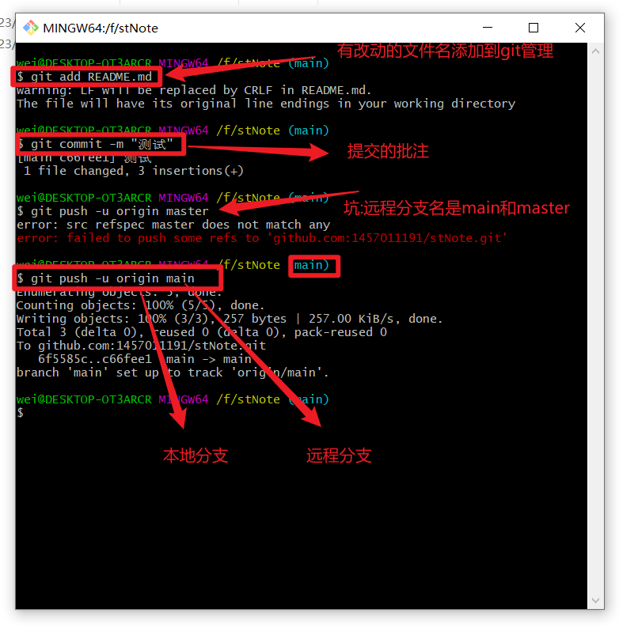

搞完头条项目，往回看微服务，docker然后再操作一下docker完成一下头条然后，写简历，一边过一下vue。

有巣app的搜索地址，es搜索距离

线程和进程的区别：
线程是比进程更小的运行单位，电脑的任务管理器可以看到电脑的进程运行状态。一个软件的运行就是一个进程，同一个进程中可能用多个互相影响的线程，
线程之间共享堆和方法区，但每个线程拥有自己的程序计数器（线程切换来回时记录上次线程运行到哪了）、虚拟机栈、本地方法栈
（保证线程中的局部变量不被别的线程访问到）

堆和方法区是所有线程共享的资源，其中堆是进程中最大的一块内存，主要用于存放新创建的对象 (几乎所有对象都在这里分配内存)，
方法区主要用于存放已被加载的类信息、常量、静态变量、即时编译器编译后的代码等数据。

并发与并行的区别：
并发：两个及两个以上的作业在同一   时间段   内执行。
并行：两个及两个以上的作业在同一   时刻    执行。
最关键的点是：是否是 同时 执行

线程生命周期：
NEW: 初始状态，线程被创建出来但没有被调用 start() 。
RUNNABLE: 运行状态，线程被调用了 start()等待运行的状态。
BLOCKED ：阻塞状态，需要等待锁释放。
WAITING：等待状态，表示该线程需要等待其他线程做出一些特定动作（通知或中断）。
TIME_WAITING：超时等待状态，可以在指定的时间后自行返回而不是像 WAITING 那样一直等待。
TERMINATED：终止状态，表示该线程已经运行完毕。

new出一个线程用run()而不用start可行吗？会怎样？
调用 start() 方法方可启动线程并使线程进入就绪状态，直接执行 run() 方法的话，会把 run() 方法当成
一个 main 线程下的普通方法去执行，而不会以多线程的方式执行。

